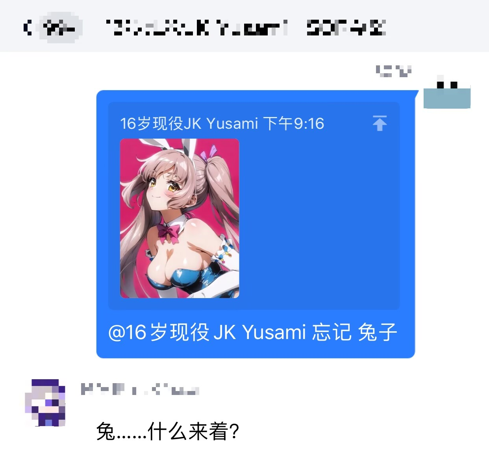

# YusamiBot
**一个实验性的项目，做出来单纯因为好玩，实现了一些有意思的功能**

*注：该项目是基于 [go-cqhttp](https://github.com/Mrs4s/go-cqhttp) 消息框架，使用 golang 开发的 qq 机器人*
## 实现功能：
- 学习，包含精确学习与模糊学习（所以就没做 help 指令，你看毕竟可以学更有成就感……）
- 加精与查看，直接存入 MongoDB 中
- 看看新闻（获取 60 秒读懂世界内容）
- 新番查询（与 Bangumi 同步）
- 番剧查找（整合同步多个动漫网站数据，包含动漫花园数据）
- pixiv 美图，特别感谢 [LoliconApi](https://api.lolicon.app/#/) *现在由于鹅的大力封锁，全部转成了扫码观看*
- 原神抽卡（？别看我，群友让我加的，原神什么的真不熟）
- jm 本子查询与观看（有傻冒放着人家图床不用给自己服务器流量冲业绩，**后面真会改的**）
- 日记功能，每天写日记多是一件美式，实时更新，有专门的页面可供查看
- 课表查询，目前属于 UESTC 限定功能，没什么验证（飞书：锅来），绑对了你连住你隔壁的男同今天上什么课都一清二楚
- ai 绘图，曾经可以使用，现在穷了，给点（
- ai 聊天，使用的是 CharacterAi，openAi 以后再说？
- openAi 最近比较火，加了一个 openAi 的 chat 功能，但是要求你自己有一个 openAi 的账号（且账号上有额度），因为是为了玩玩匆忙写出来的，很多功能不完善。
- b站订阅提醒，包含直播和动态提醒

## 安装：
首先下载最新的 release 文件，将其解压到文件夹中

本项目使用 websocket 连接至 go-cqhttp，因此将 go-cqhttp 的 config 文件中的相关配置项改成如下样式:

```yaml
  # 反向WS设置
  - ws-reverse:
      # 反向WS Universal 地址
      # 注意 设置了此项地址后下面两项将会被忽略
      universal: ws://127.0.0.1:8081/msg
```

项目由于其他功能会使用部分路径，因此反向 ws 接口为 `/msg`，其余配置如账号等并没有特别特殊的地方

在启动 go-cqhttp 之后，运行项目文件夹中的 Lealra 文件，bot 启动

## 相关功能：
### 学习
该功能模块主要有两种不同的模式，一种是精确学习，另一种是模糊学习：

- 精确学习会精确匹配全字段，模糊匹配则检测是否包含
- **优先精确匹配，其次再模糊匹配**


让 bot 遗忘只用回复需要遗忘的消息即可：



**遗忘也会优先遗忘精确学习的回复，其次才是模糊学习**

#### 清理僵尸回复
由于本项目使用的是 qq 图床（也就是最方便 CQ 码操作的格式），很多情况下容易出现图片过期的情况。如果回复是纯图片，就会造成无回复的现象。

针对这个问题项目有三点应对策略：

1. **清除僵尸回复**

   所谓僵尸回复就是占用数据库存储空间但实际上已经过期且无法使用的回复，只要回复中图片存在过期那么都可以将其视为失去了原本的表述意义，因此需要将其全部清理：

   

   **切记该功能仅能在私聊中使用！且要求使用者是预先设置好的 admin 用户！**
2. **通过发送图片保存图床稳定性**

   不推荐使用，在配置文件中有详细说明，频繁发送消息还可能让你更容易被鹅盯上最后 bot 死翘翘就不好玩了

   配置中设置后自动执行，周期为 48 小时
3. **base64备份（未完成）**

   实际上发出图片后被 go-cqhttp 解析为 CQ code 会有两个属性：一个是 file 为本地缓存文件名，另外一个 url 是 qq 图床地址，只有两个都失效后该图片才会发不出去，本地缓存文件名为图像的 md5，qq 图床也使用 md5 进行标识，我们可以创建一个 md5->base64 的映射表，缺什么补什么，并且一旦使用 base64 重新发送一次，前面两个属性就又会重新生效（md5 不变）

### 加精与查看
实际上该功能在使用过程中还是发现有诸多问题，因此后续会加以更正

目前支持聊天记录加精（包括单层转发），根据内容（word）、昵称（name）、uid（uid）、时间（date）进行匹配，四项参数可以任意搭配

只要回复消息尾部包含“设精”，则会自动设精，有相应权限还可以直接加入群聊精华：


### 看看新闻
如图：


### 新番查询

*待续*